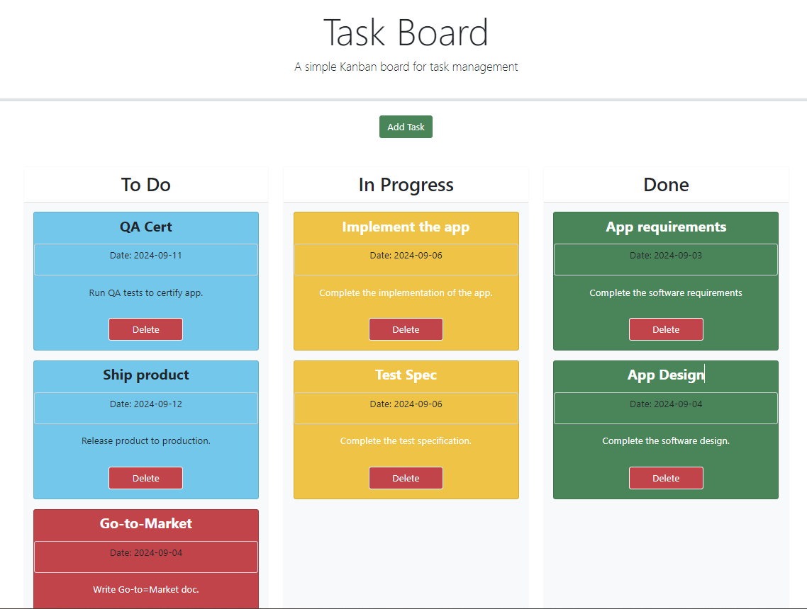

# Simple Kanban Board

## Summary
In this challenge, we'll build a simple taks board that allows a team to create and manage project tasks. This app runs in the browser and features dynamically updated HTML and CSS powered by jQuery.

The specific features of this application, along with the user interactions, are outlned in the following section.

## Operation
1. When the task board is opened, the list of project tasks is displayed in columns representing the task progress state (Past Due, Not Yet Started, In Progress, Completed)

2. Each task is color coded according to the following:
* Ample time to complete (Blue)
* Nearing the deadline (Yellow)
* Overdue (Red)
* Completed (Green)

3. When the user clicks on the button to define a new task, they are able to enter the title, description and deadline date for the new task into a modal dialog

4. When the user clicks on the save button for a given task the properties of that task are saved in localStorage

5. When the user drags a task to a different progress column, the task's progress state is updated accordingly and will stay in the new column after refreshing

6. When the user clicks the delete button for a task the task is removed from the task board and will not be added back after refreshing

7. When the user refreshes the page, the saved tasks presist

## Project GitHub Links
Project repo: 

Deployed app: 

## Screenshot of the Application

